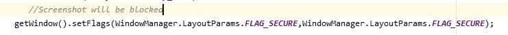
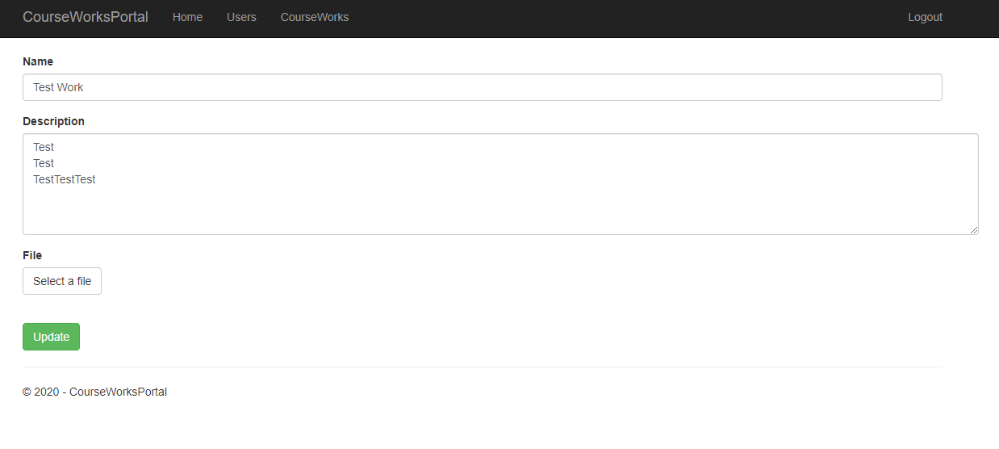

# CourseWorkPortal
Темой курсового проекта является разработка программного средства «Портал по заказу курсовых работ» - интернет-ресурса, целью которого является,предоставление коллекции курсовых работ, 
которые могут помочь или дать направлении в написании своей курсовой работы.
Курсовой проект представлен как мобильным(клиент) приложением так и веб(администратор) приложением. Для хранение данных используется Amazon RDS MySQL. Сервер загружен на Azure.

Курсовой проект представлен как мобильным(клиент) приложением так и веб(администратор) приложением.

 
Для хранение данных используется Amazon RDS MySQL. Сервер загружен на Azure

Выполнение общих требований:
1.	Минимальное количество экранов 8 – реализовано 
2.	Приложение связано с Amazon RDS MySQL базой данный на основе REST API. Работа с HTTP происходит на базе библиотеки Volley.Дополнительно данные шифруются с помощью “Соли”.
3.	Защитить приложение авторизацией - реализовано 
4.	Реализовать зашиту приложения – в приложении на любом из экранов нельзя делать скриншот, сделано с помощью

5.	Использовать обфускацию проекта - ДА (c помощью proguard)

Пройдемся по мобильному приложению

1.	Сразу после запуска мы увидим окно авторизации и регистрации. Авторизация происходит с помощью механизма JWT токена для создания токенов доступа, 
основанный на формате JSON. JWT создаются сервером, подписываются секретным ключом и передаются клиенту, 
который в дальнейшем использует данный токен для подтверждения своей личности.
Если же клиент выбирает регистрацию, то введенные данные отправляются на сервер и создается аккаунт. 

2.	После ввода данных (имя пользователя и пароль) мы можем видеть все записи (курсовые работы), которые есть на данный момент

3.	Для переключения между всеми курсовыми и избранными работами был реализован DrawerLayout, элементы в котором и служат для переключения. 
Также в этом же элементе управления есть кнопка деаутентификации, по нажатию на которую пользователь переместится на окно авторизации и регистрации

4.	Для просмотра подробной информации по выбранной курсовой работе был реализован WorkDetailFragment ,
который помогает не только изучить детализацию по определенной работе, но и добавить её в избранное, а также загрузить приложение прикрепленное к ней

5.	Можно посмотреть все работы, которые были добавлены в избранное выбрав в меню “Favorite”

Теперь перейдем ко второй части приложения – администрирование 

Сервер(админка) была загружена на Azure 
( https://courseworksportal.azurewebsites.net/ )

Login: admin 

password : 123

1.	При загрузке открывается страница авторизации, где нужно ввести login и пароль, только пользователь с уровнем доступа Admin сможет пройти аутентификацию.
Так же на сервере используются Cookie 

2.	Для просмотра и управлением всех курсовых работ существует раздел CourseWorks.
Здесь выведен список всех работ и каждую из них есть возможность: просмотреть, отредактировать, удалить(скриншоты будут ниже).

3.	 При нажатии на “Add work” откроется форма по добавлению работы. Нужно указать заголовок, описание и прикрепить файл с самой работой. 

4.	Просмотр выбранной работы

5.	Редактирование работы 

6.	Удаление работы 

7.	Так же представлен список всех пользователей, с возможностью добавления, редактирования и удаления 

8.	При нажатии на “Add user” открывается форма добавления нового пользователя.
Нужно указать логин пользователя, пароль и роль в системе(user/admin) 

9.	Редактирование пользователя 

